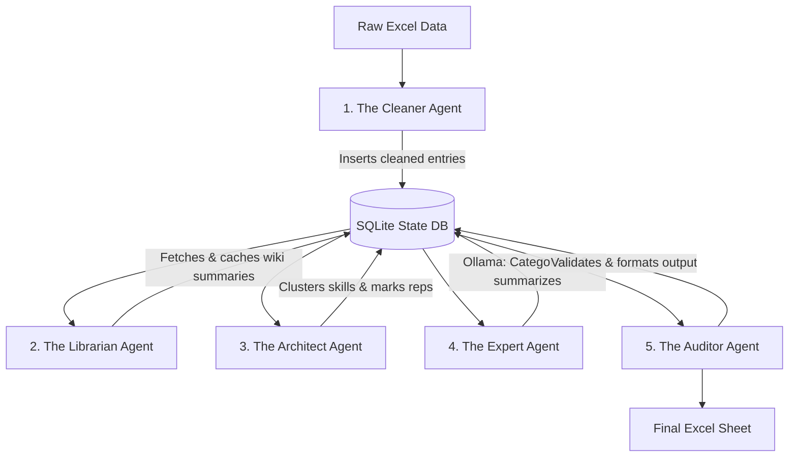

# Multi-Agent Worker Architecture (agents.md)

To execute the skill categorization pipeline efficiently and reliably on a local CPU (Dell Latitude 3420), we partition the workload into a **Multi-Agent Worker System**. Each agent is a specialized component with a single, clear responsibility, working in sequence and communicating via a shared **SQLite State Database (`pipeline_state.db`)**.

---

---

## Agent Specifications

### 1. The Cleaner Agent (Ingestion & Pre-filtering)
* **Objective:** Ingest the raw data, perform basic cleaning, and filter out obvious, non-ambiguous junk.
* **Responsibilities:**
  * Read [skill_master_review_v1.xlsx](file:///c:/Users/nipun.kumar/Projects/taxonomy/skill_master_review_v1.xlsx).
  * Trim whitespace, normalize case variations (e.g., `python` $\rightarrow$ `Python`), and remove duplicate records.
  * Apply deterministic rules to flag obvious noise (e.g., single letters other than `C`/`R`, purely numeric values, special character patterns).
  * Initialize the SQLite state database (`pipeline_state.db`) and insert the records with a state of `PENDING` or `SKIPPED_NOISE`.
* **Output:** Cleaned database tables with basic metadata.

### 2. The Librarian Agent (Context Harvester)
* **Objective:** Query the Wikipedia API politely, fetch descriptive extracts, and cache them to eliminate duplicate network traffic.
* **Responsibilities:**
  * Read `PENDING` records from the SQLite database.
  * Group skills into batches of **50** and query the Wikipedia search/titles API in a single HTTP request using the `titles` parameter (e.g., `titles=A|B|C`).
  * Identify correct pages, resolve redirects, and fetch the summary extract (maximum 400 characters).
  * Sleep for 1.0–2.0 seconds between batches to maintain a polite crawl rate.
  * Identify and send custom User-Agent headers to prevent IP blocking.
  * Use `tenacity` for robust error handling and exponential backoff on network failures.
  * Save all extracts to a persistent local cache (`wiki_cache.db`).
* **Output:** Wikipedia extracts stored for each valid skill.

### 3. The Architect Agent (Semantic Grouping & Deduplication)
* **Objective:** Group similar skills semantically to minimize the number of slow LLM inference operations.
* **Responsibilities:**
  * Load all valid skills from the SQLite database.
  * Generate sentence embeddings locally using a lightweight CPU model (`sentence-transformers/all-MiniLM-L6-v2`).
  * Run a fast clustering algorithm (like **Birch** or **Cosine Similarity Thresholding**) to group near-synonyms and spelling variants (e.g., `React.js`, `ReactJS`, `React JS` $\rightarrow$ Cluster ID 45).
  * Pick the most frequent skill in each cluster (based on user count) as the **Representative Skill**.
  * Write the `cluster_id` and `is_representative` flag back to the database.
* **Output:** Grouped skills, reducing the unique LLM workload by up to 80%.

### 4. The Expert Agent (LLM Categorizer & Summarizer)
* **Objective:** Run local LLM inference on Ollama to categorize and summarize the representative skills.
* **Responsibilities:**
  * Query SQLite for unique representative skills that are pending categorization.
  * Construct a prompt containing the skill name, Wikipedia context, related keywords (`top_1`–`top_5`), and the full target taxonomy.
  * Call **Ollama** (using the `qwen2.5:7b-instruct` or `llama3.2:3b-instruct` model) in structured JSON mode.
  * Classify the skill into exactly one `Skill Bucket` and `Skill Sub-Bucket`. If the term is not a professional/soft skill (e.g., corporate name or random word), classify it into the `"Noise / Not a Skill"` bucket.
  * Generate a high-quality, one-liner summary of the skill.
  * Save the category, sub-category, and one-liner to the database.
* **Output:** Categorization and summaries for all representative skills.

### 5. The Auditor Agent (Verification & Quality Control)
* **Objective:** Perform post-processing, validation, and final compilation.
* **Responsibilities:**
  * Propagate the categories and summaries from the representative skills to all other members of their respective clusters.
  * Validate that the LLM output matches the official taxonomy in [skill_taxonomy.xlsx](file:///c:/Users/nipun.kumar/Projects/taxonomy/skill_taxonomy.xlsx). If a spelling error or hallucination occurs, run a fallback fuzzy matcher to map it to the closest valid sub-bucket.
  * Flag high-uncertainty items (e.g., skills placed in `"Noise / Not a Skill"` or those where the LLM returned `Unknown`) in a `requires_review` column.
  * Write the final compiled data to the output Excel file.
* **Output:** The final categorized Excel sheet ready for taxonomy team review.
